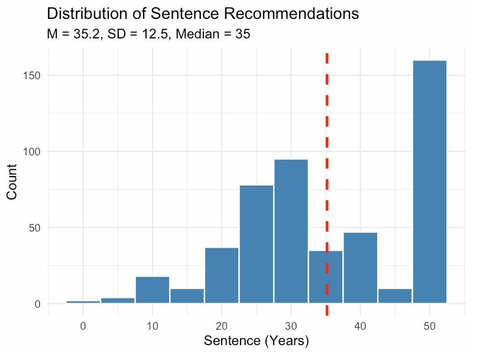

# PunishmentPunitiveness

[](https://opensource.org/licenses/MIT)
[](https://osf.io/kr7y2/overview?view_only=d312013b176a411c8cf6c126d7f54617)
[](https://www.r-project.org/)

**Investigating the Psychological Correlates of Public Punitiveness: Challenging the Prosocial Narrative of Criminal Punishment**

---

## 📊 Quick Access to Results

### Full Analysis Report
**[View Complete Interactive Analysis](https://dgk-law-and-cognition-lab.github.io/PunishmentPunitiveness/analysis/Punishment_2_1_2_Final_Script.html)** — All statistics, tables, and figures in one document

### Visualizations

| Figure | Description | Link |
|--------|-------------|------|
| 🔥 **Construct-Level Heatmap** | Correlations between punitiveness and all 16 constructs | [View](https://dgk-law-and-cognition-lab.github.io/PunishmentPunitiveness/analysis/output/figures/heatmap_construct_level.png) |
| 🔥 **Cluster-Level Heatmap** | High-level view of cluster relationships | [View](https://dgk-law-and-cognition-lab.github.io/PunishmentPunitiveness/analysis/output/figures/heatmap_cluster_level.png) |
| 🔗 **Intercorrelations** | Correlations among all correlate measures (H3) | [View](https://dgk-law-and-cognition-lab.github.io/PunishmentPunitiveness/analysis/output/figures/heatmap_intercorrelations.png) |
| 📊 **Sentence Distribution** | Overall distribution of recommended sentences | [View](https://dgk-law-and-cognition-lab.github.io/PunishmentPunitiveness/analysis/output/figures/histogram_sentence.png) |
| 📊 **Sentences by Vignette** | Distribution broken down by condition | [View](https://dgk-law-and-cognition-lab.github.io/PunishmentPunitiveness/analysis/output/figures/histogram_sentence_by_vignette.png) |
| 📈 **EFA Scree Plot** | Factor analysis eigenvalues | [View](https://dgk-law-and-cognition-lab.github.io/PunishmentPunitiveness/analysis/output/figures/efa_scree_plot.png) |

### Data Tables

| Table | Description | Link |
|-------|-------------|------|
| **H1 Results** | All punitiveness correlations with FDR correction | [View CSV](https://dgk-law-and-cognition-lab.github.io/PunishmentPunitiveness/analysis/output/tables/H1_punitiveness_correlations.csv) |
| **Reliability** | Cronbach's α for all scales | [View CSV](https://dgk-law-and-cognition-lab.github.io/PunishmentPunitiveness/analysis/output/tables/reliability_alphas.csv) |
| **Descriptives** | Means, SDs, ranges for all variables | [View CSV](https://dgk-law-and-cognition-lab.github.io/PunishmentPunitiveness/analysis/output/tables/descriptive_statistics.csv) |
| **Full Correlation Matrix** | Complete construct-level correlations | [View CSV](https://dgk-law-and-cognition-lab.github.io/PunishmentPunitiveness/analysis/output/tables/correlation_table_construct_level.csv) |
| **Vignette Stability** | Cross-vignette correlation consistency | [View CSV](https://dgk-law-and-cognition-lab.github.io/PunishmentPunitiveness/analysis/output/tables/vignette_correlation_stability.csv) |

---

## Overview

This repository contains the data, analysis code, and materials for a multi-study research program examining the psychological drivers of criminal punitiveness. Our central thesis challenges the conventional academic and public discourse that frames criminal punishment as prosocially motivated (deterrence, rehabilitation, incapacitation, public safety), instead demonstrating that punitiveness correlates more strongly with darker psychological factors.

### Key Finding

> Public punitiveness is significantly more strongly associated with **hostile psychological factors** (hatred, revenge, support for harsh treatment) than with **legitimate crime concerns** (fear of crime, perceived crime rates), calling into question whether punishment attitudes are truly prosocially motivated.

## Citation

If you use this data, code, or materials in your research, please cite:

```bibtex
@article{simon2025punishment,
  title = {Is Punishment Prosocial? Investigating the Psychological Correlates of Public Punitiveness},
  author = {Simon, Dan and Kamper, David G.},
  journal = {Working Paper},
  year = {2026},
  institution = {University of Southern California, Gould School of Law, University of California, Los Angeles}
}
```

## Research Questions

1. **Is punishment truly prosocial?** We test whether public punitiveness correlates with prosocial concerns (crime rates, public safety) or darker psychological factors.

2. **What predicts punitiveness?** We examine correlations between punitiveness and 16+ psychological constructs across multiple domains.

3. **Is there a "punitiveness mindset"?** We test whether the various correlates of punitiveness are themselves intercorrelated, suggesting a coherent psychological profile.

## Pre-registered Hypotheses

| Hypothesis | Description | Status |
|------------|-------------|--------|
| **H1** | Punitiveness will be positively correlated with all correlate measures | ✅ Supported |
| **H2** | Hostile Aggression cluster will show stronger correlations with punitiveness than Crime Concerns cluster | ✅ Supported |
| **H3** | Most correlate measures will be positively intercorrelated | ✅ Supported |

## Study Design

### Participants
- **N = 496** (after exclusions)
- Recruited via Prolific
- US adult residents
- Balanced gender distribution

### Punitiveness Measures
Our composite punitiveness construct (α = .84) includes:
- Support for more punishment (2 items)
- Rejection of parsimony principle (2 items)
- Support for three-strikes laws (2 items)
- Support for life without parole
- Support for death penalty
- Sentencing recommendation in vignette case

### Correlate Clusters

| Cluster | Constructs | Items |
|---------|------------|-------|
| **Crime Concerns** | Perceived crime rates, Fear of crime | 5 |
| **Emotions Toward Criminals** | Hatred, Anger | 5 |
| **Hostile Aggression** | Social exclusion, Degradation, Infliction of suffering, Prison violence tolerance, Support for harsh conditions, Revenge | 16 |
| **Personality** | RWA, SDO, Vengefulness, Violence proneness, Racial resentment, Blood sports viewership | 30 |

### Vignette Conditions
Three vignette conditions to enhance generalizability of sentencing decisions:
1. Second-degree murder (domestic dispute)
2. Second-degree murder (robbery)
3. Second-degree murder (road rage)

## Key Results

### Correlations with Punitiveness

[📊 View interactive heatmap](https://dgk-law-and-cognition-lab.github.io/PunishmentPunitiveness/analysis/output/figures/heatmap_construct_level.png)

| Construct | r | Significance |
|-----------|---|--------------|
| Harsh prison conditions | .56 | *** |
| Social exclusion | .54 | *** |
| Hatred of criminals | .53 | *** |
| Infliction of suffering | .52 | *** |
| Right-wing authoritarianism | .50 | *** |
| Racial resentment | .46 | *** |
| Anger toward criminals | .45 | *** |
| Degradation | .44 | *** |
| Revenge | .43 | *** |
| Violence proneness | .41 | *** |
| Perceived crime rates | .40 | *** |
| Prison violence tolerance | .35 | *** |
| Social dominance orientation | .32 | *** |
| Fear of crime | .18 | ** |

### H2 Test: Hostile Aggression vs. Crime Concerns

```
r(Punitiveness, Hostile Aggression) = .61
r(Punitiveness, Crime Concerns)     = .34
Steiger's Z = 7.89, p < .001
```

**Conclusion:** Hostile psychological factors are significantly stronger correlates of punitiveness than crime concerns, contradicting the prosocial justification narrative.

## Repository Structure

```
PunishmentPunitiveness/
├── README.md                 # This file
├── LICENSE                   # MIT License
├── CITATION.cff              # Citation metadata
├── CONTRIBUTING.md           # Contribution guidelines
│
├── data/
│   ├── raw/                  # Original data files
│   │   └── Data_Final.csv
│   ├── processed/            # Cleaned and transformed data
│   │   └── punishment_212_cleaned_data.csv
│   └── codebook/             # Variable documentation
│       └── CODEBOOK.md
│
├── analysis/
│   ├── Punishment_2_1_2_Final_Script.Rmd    # Main analysis script
│   ├── Punishment_2_1_2_Final_Script.html   # Rendered output
│   └── output/               # Generated tables and figures
│       ├── tables/
│       │   ├── H1_punitiveness_correlations.csv
│       │   ├── reliability_alphas.csv
│       │   ├── descriptive_statistics.csv
│       │   ├── correlation_table_construct_level.csv
│       │   └── vignette_correlation_stability.csv
│       └── figures/
│           ├── heatmap_construct_level.png
│           ├── heatmap_intercorrelations.png
│           ├── histogram_sentence.png
│           └── efa_scree_plot.png
│
├── materials/
│   ├── stimuli/              # Survey stimuli
│   │   ├── PUNISHMENT__STIMULUS__2_7_--_MASTER.docx
│   │   └── vignettes/
│   └── preregistration/      # Pre-registration documents
│       └── Punishment_2_1_2_--_Pre-registration__pro-social.docx
│
├── docs/
│   ├── ANALYSIS_PLAN.md      # Five-phase analysis approach
│   └── METHODOLOGY.md        # Detailed methodological notes
│
└── manuscripts/
    └── drafts/               # Paper drafts (not for circulation)
```

## Quick Start

### Requirements

- R ≥ 4.0
- RStudio (recommended)
- Required R packages:

```r
required_packages <- c(
  "tidyverse",      # Data manipulation and visualization
  "psych",          # Cronbach's alpha, correlations
  "corrplot",       # Correlation heat maps
  "Hmisc",          # rcorr for correlation matrices
  "cocor",          # Steiger's Z-test
  "lme4",           # Mixed-effects models
  "lmerTest",       # P-values for mixed models
  "car",            # ANOVA, diagnostics
  "effectsize",     # Effect size calculations
  "ggcorrplot",     # Correlation plots
  "knitr",          # Tables
  "broom",          # Tidy model outputs
  "lavaan"          # CFA
)

# Install all packages
install.packages(required_packages)
```

### Running the Analysis

1. Clone the repository:
```bash
git clone https://github.com/DGK-Law-and-Cognition-Lab/PunishmentPunitiveness.git
cd PunishmentPunitiveness
```

2. Open `analysis/Punishment_2_1_2_Final_Script.Rmd` in RStudio

3. Update the data path in the script to your local path:
```r
raw_data <- read.csv("data/raw/Data_Final.csv", stringsAsFactors = FALSE)
```

4. Knit the document or run chunks sequentially

## Analysis Pipeline

### Phase 1: Data Preparation
- Data loading and filtering
- Attention check exclusions
- Missing data assessment

### Phase 2: Construct Creation
- Reverse coding (25 items)
- Composite score calculation
- Scale reliability (Cronbach's α)

### Phase 3: Confirmatory Analysis
- H1: Correlation tests
- H2: Steiger's Z-test for dependent correlations
- H3: Intercorrelation analysis

### Phase 4: Sensitivity Analysis
- FDR correction for multiple comparisons
- Cross-vignette correlation stability
- Outlier diagnostics

### Phase 5: Advanced Modeling
- Exploratory factor analysis
- Multiple regression
- Hierarchical regression
- Confirmatory factor analysis

## Scale Reliability

| Construct | Cronbach's α | N Items |
|-----------|--------------|---------|
| Punitiveness (8 items) | .84 | 8 |
| RWA | .87 | 5 |
| SDO | .92 | 8 |
| Vengefulness | .88 | 5 |
| Racial Resentment | .90 | 4 |
| Hostile Aggression Cluster | .92 | 16 |
| Personality Cluster | .92 | 30 |

## Visualization

### Construct-Level Correlations

[](https://dgk-law-and-cognition-lab.github.io/PunishmentPunitiveness/analysis/output/figures/heatmap_construct_level.png)
*Click image to view full size*

### Sentence Distribution

[](https://dgk-law-and-cognition-lab.github.io/PunishmentPunitiveness/analysis/output/figures/histogram_sentence.png)
*Click image to view full size*

## Ethical Considerations

This research was conducted in accordance with ethical guidelines and approved by USC IRB. Key ethical considerations include:

- **Informed consent**: All participants provided informed consent
- **Anonymity**: No identifying information was collected
- **Sensitive topics**: Questions about race, crime, and punishment were handled with care
- **Response bias**: We acknowledge potential social desirability effects in responses to sensitive items

## Limitations

1. **Correlational design**: Cannot establish causal relationships
2. **Online sample**: Results may not generalize to all populations
3. **Self-report measures**: Subject to social desirability bias
4. **Single measurement occasion**: Cannot assess temporal stability

## Future Directions

- **Experimental studies**: Testing causal mechanisms
- **Text analysis**: Computational analysis of open-ended justifications
- **Cross-cultural replication**: Testing generalizability beyond US samples

## Authors

- **Dan Simon** - USC Gould School of Law, Department of Psychology
- **David G. Kamper** - UCLA Department of Psychology

## Contact

For questions about this research, please contact:
- Dan Simon: dsimon@law.usc.edu
- David G. Kamper: davidgkamper@ucla.edu

## License

This project is licensed under the MIT License - see the [LICENSE](LICENSE) file for details.

## Acknowledgments

- Prolific for participant recruitment
- USC IRB for ethical oversight
- All participants who contributed to this research

---

*This research challenges the assumption that criminal punishment is fundamentally prosocial by demonstrating its strong associations with hostile psychological factors. We hope this work contributes to more honest discourse about the motivations underlying public punitiveness.*
